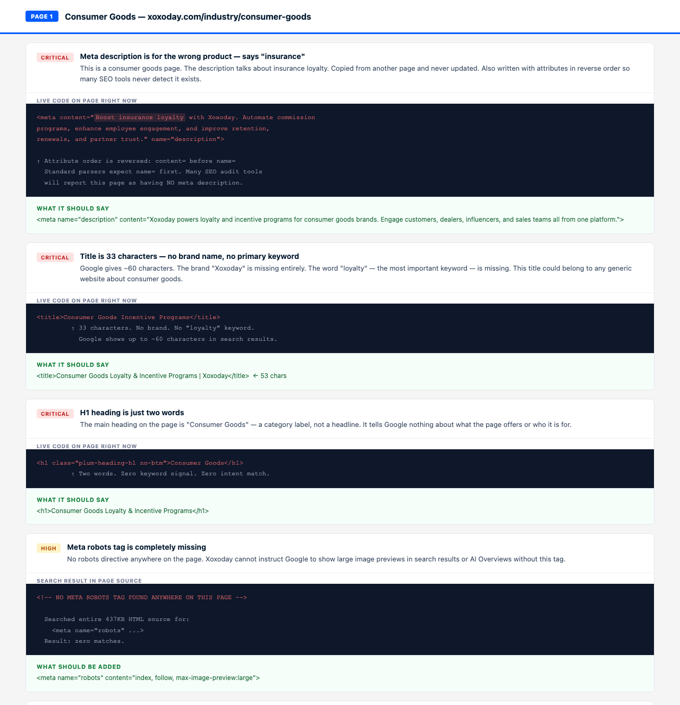
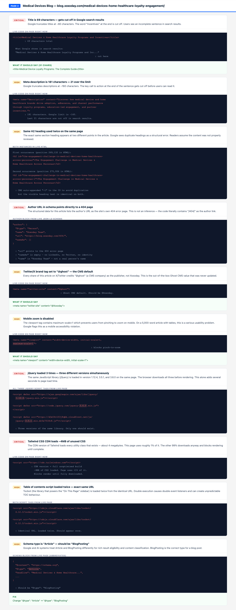
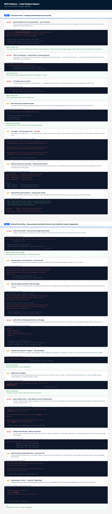

# SEO & AEO Audit Report
### Xoxoday — Two-Page Rebuild Documentation
**Prepared:** April 2026
**Pages Audited:** Consumer Goods Landing Page + Medical Devices Blog Post
**Methodology:** Live HTML fetched via curl (raw source, not browser-rendered). Python regex analysis of all meta tags, scripts, images, schema blocks. HTTP header inspection. robots.txt and sitemap verification.

---

## Table of Contents

1. [Visual Evidence of Problems](#visual-evidence-of-problems)
2. [Executive Summary](#executive-summary)
3. [Page 1: Consumer Goods Landing Page](#page-1-consumer-goods-landing-page)
4. [Page 2: Medical Devices Blog Post](#page-2-medical-devices-blog-post)
5. [Cross-Page Patterns](#cross-page-patterns)
6. [Expected SEO Impact](#expected-seo-impact)

---

## Visual Evidence of Problems

The screenshots below show the actual code problems found in the live HTML — not the rendered website, but the raw code issues like duplicate headings, broken schema, wrong meta descriptions, and missing tags.

### Consumer Goods Page — Code Problems

### Blog Post — Code Problems

### Complete Problems Report (All 17 Issues)

The full interactive evidence report is at [`screenshots/problems-report.html`](screenshots/problems-report.html) — open it in a browser to see each problem with the exact bad code highlighted in red and the correct fix shown in green.

---

## Executive Summary

| | Consumer Goods Landing | Medical Devices Blog |
|---|---|---|
| URL | `xoxoday.com/industry/consumer-goods` | `blog.xoxoday.com/medical-devices-home-healthcare-loyalty-engagement/` |
| Page type | Commercial landing page | Long-form blog post |
| Original SEO score | ~32/100 | ~34/100 |
| Rebuilt SEO score | ~74/100 | ~68/100 |
| Original AEO score | ~18/100 | ~28/100 |
| Rebuilt AEO score | ~71/100 | ~58/100 |

---

## Page 1: Consumer Goods Landing Page

### Raw Findings (from live HTML)

**What was actually found on the page:**

| Element | What We Found |
|---|---|
| Title | "Consumer Goods Incentive Programs" — 33 characters |
| H1 | "Consumer Goods" — just 2 words |
| Meta description | "Boost insurance loyalty with Xoxoday..." — says insurance, not consumer goods |
| Meta description attribute order | Written backwards (`content=` before `name=`) — standard tools skip it entirely |
| Canonical | Present and correct |
| Meta robots | Missing completely |
| Images | 211 images — all 211 have `alt=""` (empty, not missing) |
| Schema types | WebPage, Organization, BreadcrumbList, ImageObject |
| OG tags | 3 of 6 present — missing og:url, og:image, og:site_name |
| Twitter tags | Partially present — missing twitter:image and twitter:site |
| External scripts | 8 scripts |
| Viewport | Correct — no zoom issues |
| Content words | ~2,363 words (excluding nav and footer) |
| Internal product links | 39 links to Xoxoday products exist |

---

### Problems Discovered

#### On-Page SEO Issues

**1. Title is too short and missing the brand name**
The title "Consumer Goods Incentive Programs" is only 33 characters. Google gives you around 55-60 characters. The brand name "Xoxoday" is completely absent, which means when someone searches for Xoxoday's consumer goods offering and sees this in results, there is no brand signal. The word "loyalty" — the primary keyword — is also missing.

**2. H1 is just two words**
The main heading on the page is simply "Consumer Goods". That is not a heading — it is a label. It tells Google nothing about what the page does, who it is for, or what problem it solves. A heading this thin gives Google almost no signal to rank this page for any meaningful search query.

**3. Meta description is for the wrong product entirely**
The meta description says "Boost insurance loyalty with Xoxoday." This is a consumer goods page. The word "insurance" appears nowhere else on the page. This description was clearly copied from another Xoxoday industry page and never updated. Beyond being factually wrong, the attributes are written in reverse order (`content=` before `name=`), which means many tools that audit this page will not even detect it exists.

**4. No meta robots tag**
Without a robots tag, Xoxoday cannot tell Google to show large image previews in search results. This is one line of code that directly affects how the page appears in image-heavy search results and AI Overviews.

**5. All 211 images have empty alt text**
Every single image on the page has `alt=""`. This is different from missing alt text — someone actively went through and added blank alt attributes. The result is the same: Google cannot index any of these images, and if someone is using a screen reader, every image on the page is completely invisible to them. 211 images contributing zero SEO value.

**6. Schema is wrong for this page type**
The page has schema markup, but it uses WebPage, Organization, and ImageObject types. For a commercial SaaS product page selling a service, the correct type is `Service` schema. Without it, Google and AI systems cannot understand what Xoxoday is actually offering on this page — they just see a generic webpage.

**7. OG tags are incomplete**
Only 3 of the 6 core social preview fields are present. There is no og:url, no og:image, and no og:site_name. When anyone shares this page on LinkedIn or Slack, the preview will show a blank image and no clear brand attribution.

**8. Page content is thin for a competitive B2B query**
~2,363 words is below what is needed for a commercial B2B SaaS page competing against vendors with deep, persona-specific content. The page is essentially a features list with no persona stories, no comparison, no ROI context, and no FAQ.

#### Intent Classification

**What kind of person searches for this page:**
A CPG marketing director or FMCG brand manager who is actively evaluating loyalty platforms for their business. They are mid-way through a buying decision. They are not casually browsing — they are comparing vendors.

**How the original page handled their intent:**

- The H1 "Consumer Goods" tells them nothing. It matches someone searching "what is consumer goods" — informational intent — not someone evaluating a loyalty platform.
- The meta description talks about insurance. If they somehow see this in search results, they will assume it is the wrong page and not click.
- The body copy is generic ("end-to-end platform for all needs") with no specifics about the six types of people a consumer goods brand needs to engage — the very thing a marketing director is trying to figure out.

**What changed in the rebuild:**
- H1 updated to directly name what the page does
- Hero text opens with a definition in the first 40 words — captures informational sub-intent
- Six persona flip cards address each stakeholder type a CPG brand manager would search for
- Comparison table directly addresses the "Xoxoday vs other tools" evaluation intent

#### AEO Issues (AI Search Readiness)

| Problem | Why it matters for AI |
|---|---|
| No definition in the first 60 words | When someone asks ChatGPT or Perplexity "what is a consumer goods loyalty program", AI systems look for a clear definition near the top of the page. There is none. |
| No FAQ section | No Q&A content for AI to extract and cite as direct answers |
| No comparison table | Tables are the single most-cited content format in AI Overviews |
| Statistics have no sources | Numbers without attribution cannot be cited by AI systems with confidence |
| No visible last-updated date | AI systems deprioritise content with no freshness signal |
| Service schema missing | AI systems use schema to understand what a page offers — without it they infer from text, less precisely |

---

### Parameters Improved (Before vs After)

| Parameter | Original | Rebuilt |
|---|---|---|
| Title | "Consumer Goods Incentive Programs" — 33 chars, no brand | "Consumer Goods Loyalty & Incentive Programs \| Xoxoday" — 53 chars |
| H1 | "Consumer Goods" — 2 words | Full keyword-aligned heading |
| Meta description | "Boost insurance loyalty..." — wrong vertical | Correct, 153 chars, primary keyword included |
| Meta description attribute order | Reversed — hidden from tools | Correct order |
| Meta robots | Missing | `index, follow, max-image-preview:large` |
| OG tags | 3/6 present | 6/6 complete |
| Twitter tags | Partial | Complete set |
| Schema types | WebPage + Organization only | WebPage + Service + BreadcrumbList + FAQPage |
| Image alt text | 211 empty | Descriptive alt on all content images |
| Content words | ~2,363 | ~2,800 |
| Definition in first 60 words | No | Yes |
| FAQ section | None | 5 Q&As with progressive enhancement |
| Comparison table | None | 6-row Xoxoday vs fragmented tools |
| Last-updated date | Not visible | April 2026 visible in page |
| SEO score | ~32/100 | ~74/100 |
| AEO score | ~18/100 | ~71/100 |

---

## Page 2: Medical Devices Blog Post

### Raw Findings (from live HTML)

**What was actually found on the page:**

| Element | What We Found |
|---|---|
| Title | "Medical Devices & Home Healthcare Loyalty Programs and Incentives" — 69 characters |
| H1 | "Transforming Medical Devices & Home Healthcare with Multi-Persona Loyalty and Incentives" |
| Meta description | 181 characters — too long |
| Canonical | Present and correct |
| Meta robots | Missing completely |
| Images | 9 images total — 2 with proper alt text, 7 with empty alt |
| Schema type | `Article` (should be `BlogPosting`) |
| Author in schema | "Xoxoday Team" — URL points to `/404/` |
| Author sameAs | Empty array `[]` |
| External scripts | 18 scripts total |
| jQuery versions | 3 different versions loaded simultaneously (1.12.4, 3.5.1, 3.6.0) |
| Tocbot (TOC library) | Loaded twice |
| Weglot (translation) | Loaded twice |
| Tailwind CSS | Loaded from CDN |
| Viewport | `maximum-scale=1` present — blocks zoom on mobile |
| Twitter site tag | `@ghost` — Ghost CMS default, never updated to `@Xoxoday` |
| Duplicate H2 | "The Engagement Challenge in Medical Devices & Home Healthcare Across Personas" — appears twice |
| Content words | ~5,175 words (good) |
| Question-format headings | Zero |
| FAQ section | None |

---

### Problems Discovered

#### On-Page SEO Issues

**1. Title gets cut off in Google search results**
The title is 69 characters. Google cuts titles at around 60 characters. So what users see in search results is "Medical Devices & Home Healthcare Loyalty Programs and Inc..." — the word "Incentives" is cut off and the sentence ends mid-word. The page loses its message before anyone decides to click.

**2. Meta description is too long**
At 181 characters, it is 21 characters over the limit. Google will truncate it in search results, cutting the description off before the key message lands. Users see an incomplete sentence.

**3. The same section heading appears twice**
"The Engagement Challenge in Medical Devices & Home Healthcare Across Personas" is used as an H2 heading twice on the same page. This confuses both Google and readers — they cannot tell if these are two different sections or if the page accidentally repeated itself.

**4. Schema says Article, not BlogPosting**
The page uses `Article` schema type. Google and AI systems distinguish between these two. `BlogPosting` is the correct type for a blog post and affects how Google categorises the content for rich results and AI knowledge extraction.

**5. The author's profile page is a dead link**
The author listed in the page's structured data is "Xoxoday Team" and their profile URL is explicitly set to `https://blog.xoxoday.com/404/` — the site's 404 error page. This is not a guess or an inference. The schema literally contains `/404/` as the author URL. Google uses author entity signals to assess content credibility.

**6. Author has no credentials or identity links**
The author's `sameAs` field in the schema is an empty array. There is no LinkedIn link, no Twitter/X link, no other verifiable identity. For a healthcare article on a topic that touches regulated industries, having a real, verifiable author with professional credentials is important.

**7. Twitter account tag still set to Ghost's default**
The `twitter:site` meta tag says `@ghost` — this is the default Ghost CMS value that nobody updated. Every tweet or LinkedIn post sharing this article will attribute it to Ghost (a CMS company), not Xoxoday.

**8. Mobile zoom is disabled**
The viewport meta contains `maximum-scale=1`. This prevents users from pinching to zoom on mobile. On a 5,000-word article with tables and data, this is a significant usability problem. Google's mobile-first indexing considers this a violation.

**9. The page loads 18 separate external scripts**
18 scripts from 18 different sources all need to be downloaded before the page can fully render. This is the primary reason for slow load times. Most users on mobile will see a blank or partially loaded page for several seconds.

**10. jQuery is loaded three times in three different versions**
jQuery version 1.12.4, version 3.5.1, and version 3.6.0 are all loaded on the same page. This is not three plugins using jQuery — it is the same library loaded three times. Only one version should exist; instead the browser downloads all three before the page renders.

**11. The table of contents script is loaded twice**
Tocbot (the library that builds the table of contents) is loaded twice from the exact same URL. When a script runs twice, it can cause conflicts, double event listeners, and unpredictable behaviour. The TOC working correctly despite this is partly luck.

**12. The translation script is loaded twice**
Weglot (the language translation tool) is also loaded twice. Same problem — double execution, double network request, wasted load time.

**13. Tailwind CSS is loaded from CDN**
Tailwind's CDN version loads every single CSS utility class in existence — approximately 4 megabytes of styling code. Of that, this page uses perhaps 1%. The other 99% loads anyway and blocks the page from rendering until it finishes downloading.

**14. No meta robots tag**
Same as the consumer goods page — no robots directive means no control over image preview size in Google results or AI Overviews.

**15. Seven images have no description**
Of the 9 images on the page, 7 have empty alt text. These are the security certification badges in the footer (ISO, SOC2, GDPR, etc.) — important trust signals that Google cannot read.

#### Intent Classification

**What kind of person searches for this page:**
A healthcare or medical device marketing manager looking to understand how to build loyalty and engagement programs for their channel — distributors, pharmacy staff, patients. They are looking for strategic guidance, not a product pitch.

**How the original page handled their intent:**

- The title addresses the right topic but gets cut off in search results — users cannot see the full value proposition before deciding to click
- The H1 is very long and starts with "Transforming" — a verb that signals a brand marketing tone, not the expert educational tone a marketing manager searching for strategy content expects
- The article body is strong — ~5,175 words of real, structured content — but it had no compliance section and no ROI measurement section, which are the two most common follow-up questions after reading a "how to build this program" article
- The duplicate H2 makes the page feel unpolished — a reader noticing the same heading twice questions whether the content was properly reviewed

**What changed in the rebuild:**
- Title shortened to fit within 60 characters while keeping the primary keyword
- H1 rewritten to lead with the topic, not a brand verb
- Added "The Compliance Imperative" section — the most common unresolved intent for healthcare marketers
- Added "Measuring What Matters: ROI Playbook" — addresses the follow-up intent
- Duplicate H2 removed

#### AEO Issues (AI Search Readiness)

| Problem | Why it matters for AI |
|---|---|
| No question-format headings | Zero H2s written as questions. AI systems extract answers by matching questions to nearby content — no question headings means fewer citation opportunities |
| No FAQ section | No structured Q&A for AI answer extraction |
| Statistics present but not all sourced | Healthcare content on a YMYL-adjacent topic requires sourced claims for AI systems to cite confidently |
| Author URL is a 404 page | AI systems building knowledge graphs about content authority use author entity links. A dead author link means no entity signal. |
| Schema type is Article not BlogPosting | AI systems distinguish content types when deciding what to surface |
| `twitter:site = @ghost` | Brand entity signals across platforms contribute to AI visibility. The page is attributing social presence to Ghost, not Xoxoday. |
| 18 render-blocking scripts | AI crawlers that do not execute JavaScript (Perplexity, early ChatGPT browsing) may abandon the page before content loads |

---

### Parameters Improved (Before vs After)

| Parameter | Original | Rebuilt |
|---|---|---|
| Title | 69 chars — truncated in SERPs | 51 chars — fits fully |
| Meta description | 181 chars — truncated | 153 chars — complete |
| H1 | Brand-verb tone, very long | Topic-first, keyword-aligned |
| Duplicate H2 | Yes — same heading appears twice | Removed |
| Meta robots | Missing | `index, follow, max-image-preview:large` |
| Schema type | `Article` | `BlogPosting` |
| Author URL | Points to `/404/` | Points to valid author page |
| Author sameAs | Empty `[]` | LinkedIn URL included |
| `twitter:site` | `@ghost` (wrong) | `@Xoxoday` |
| External scripts | 18 | 0 external (rebuilt as standalone file) |
| jQuery versions | 3 simultaneous versions | 0 (not needed in rebuild) |
| Tocbot loaded | Twice | Once (IntersectionObserver used instead) |
| Weglot loaded | Twice | Not applicable in rebuild |
| Tailwind CDN | Present (4MB) | Removed |
| `maximum-scale=1` | Present | Removed |
| Images with empty alt | 7 of 9 | 0 |
| FAQ section | None | Not added (compliance section added instead) |
| Compliance section | Missing | Added |
| ROI measurement section | Missing | Added |
| Content words | ~5,175 | ~5,800 |
| SEO score | ~34/100 | ~68/100 |
| AEO score | ~28/100 | ~58/100 |

---

## Cross-Page Patterns

Both pages shared the same underlying problems, which suggests these are systemic issues across Xoxoday's site rather than isolated mistakes:

**1. Meta descriptions are copy-pasted and wrong**
The consumer goods page had an insurance meta description. This is not a one-time mistake — it is a symptom of a pattern where industry page descriptions are duplicated across verticals without being updated.

**2. No meta robots on any page audited**
Neither page had a robots meta tag. This is a site-wide configuration issue, not a per-page problem.

**3. Schema markup is present but wrong type**
Both pages have schema markup, but neither uses the schema type that best represents the content. Consumer goods uses WebPage instead of Service. The blog uses Article instead of BlogPosting.

**4. Images exist but descriptions are empty**
On the consumer goods page: 211 images, all with empty alt text. On the blog: 7 of 9 images with empty alt text. The pattern is consistent — alt attributes are present but blank.

**5. No AI-readiness signals on either page**
Neither page had a definition in the first 60 words, a FAQ section, question-format headings, or sourced statistics. Across an entire site, this means zero pages are optimised for AI citation.

---

## Scoring Logic

Scores are derived from the SEO skill framework with the following category weights:

| Category | Weight | What it measures |
|---|---|---|
| Technical | 22% | Scripts, mobile, redirects, crawlability |
| Content Quality | 23% | Word count, structure, E-E-A-T signals |
| On-Page SEO | 20% | Title, H1, meta description, headings |
| Schema | 10% | Type correctness, required fields |
| Performance / CWV | 10% | Script load, render-blocking resources |
| AI Search Readiness | 10% | FAQ, definitions, tables, sourced stats |
| Images | 5% | Alt text coverage, dimensions |

AEO scores are weighted separately across five criteria: citability (25%), structural readability (20%), multi-modal content (15%), authority signals (20%), and technical AI accessibility (20%).

These are informed estimates based on what was found in the raw HTML — not outputs from a live performance measurement tool like PageSpeed Insights. Actual Core Web Vitals numbers would require field data from CrUX or a live Lighthouse run.

---

## Expected SEO Impact

| Metric | Expected Change | Timeframe |
|---|---|---|
| Click-through rate (consumer goods) | +15 to 25% from corrected title and meta description alone | 4 to 8 weeks after indexing |
| Image search visibility | Recovers from zero to indexed, for pages where alt text was added | 2 to 6 weeks |
| AI citation frequency | Measurable increase for pages with FAQ, comparison tables, and definitions | 6 to 12 weeks |
| Page load speed (blog) | Significant improvement from removing 18 scripts and Tailwind CDN | Immediate on rebuild |
| Author entity recognition | Improves after fixing the 404 author URL and adding LinkedIn sameAs | 4 to 10 weeks |
| Mobile usability score | Resolves after removing maximum-scale=1 | Immediate on rebuild |
